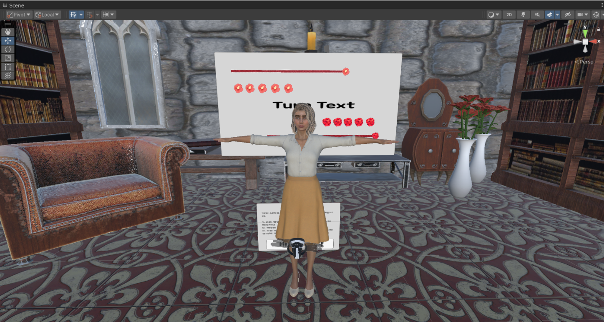
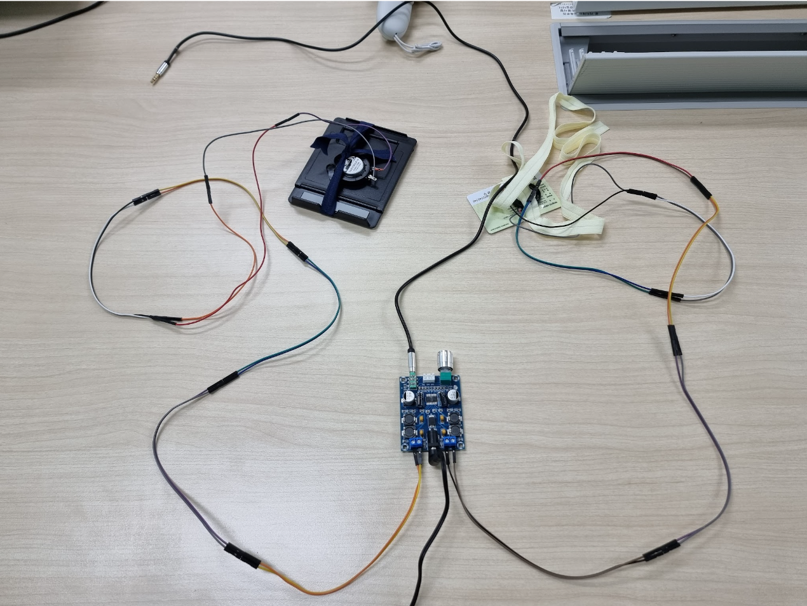

# VRSlap
VR 싸대기 때리기 게임
- 팀원:
    * [윤태웅](https://github.com/yuntaewoong)
    * [배윤지](https://github.com/baeyunji)
    * [이정민](https://github.com/ketchupmustardmayonnaise)
    * [정현우](https://github.com/jipegalre)
- 개발기간: 23'10'08 ~ 23'12'21
- 개발도구: Unity(2022.3.10) + C#
- 협업도구: Github

# Install
1. `git clone https://github.com/yuntaewoong/VRSlap.git`명령어로 프로젝트 clone
2. Unity 2022.3.10f1버전이용해 안드로이드 타겟 빌드로 APK파일 생성
3. 생성된 APK파일을 Meta Quest Developer Hub 또는 Sidequest를 이용해 퀘스트2,퀘스트3 기기에 설치

# Description
  
  
게임 진행 방식
```
1. 퀘스트로 앱을 실행 후 핸드트래킹 자동 활성화
2. 왼손으로 V인식을 시켜서 정위치 조정
3. '장미와 동백' 게임처럼 싸대기 때리기 게임 진행
4. 플레이어 또는 적이 죽으면 게임 종료
```

## Hand Tracking
  
  
- 게임 시작시 핸드트래킹 활성화

  
  
- 왼손으로 V사인을 취하면 정위치 설정(컨트롤러 없이 정위치로 돌아가는 방법 구현)


  
  
- 싸대기 때리는 속도를 반영해서 적절한 적 애니메이션 재생
  

핸드 트래킹 속도정보 계산 방법
```
(이전 프레임 손 위치 - 현재 프레임 손 위치) / DeltaTime
```


## Haptics
  
  
- 손에 부착하는 진동장비

  
  
- 뺨에 부착하는 진동장비


  
  
- 햅틱장비 전체 구조  


햅틱정보 구현 방식

```
1. 스피커를 넓은 판에 부착해 햅틱장비 구성
2. 퀘스트의 3.5mm단자에서 나오는 사운드 신호로 진동 구성(L/R채널 각각 뺨,손에 대응)
3. 사운드 출력을 강화하기 위해 앰프 사용
4. 적을 타격하거나 적에게 피격당할때 적절한 사운드신호를 재생해서 햅틱출력 구현
```

